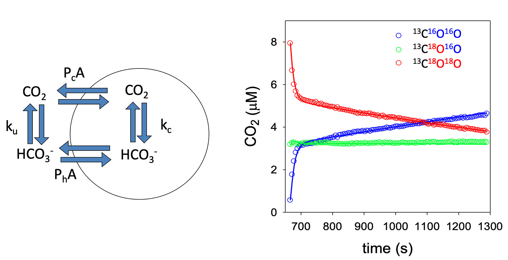
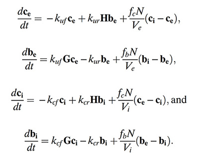

### 18O_processing: Matlab scripts to analyze 18O-CO2 exchange data
This respository contains Matlab scripts to infer carbonic andhydrase activity, cell membrane permeability, and inorganic carbon fluxes from  18O-isotope exchange experiments.
Each folder contains scripts specialized for different conditions or organisms. Consult readmes and referenced papers in the individual folders for details.
In general, the experiments are conducted by adding 18O-enriched inorganic carbon to a vessel containing phytoplankton, corals, or other organisms. 
The exchange of 18O for 16O from water is then monitored by Membrane Inlet Mass Spectrometry (MIMS). Carbonic anhydrase within the organisms accelerates 18O removal.
The observed temporal dynamics of 18O removal are then fit using a system of differntial equations to extract information on carbonic andhydrase activity, cell membrane permeability, and inorganic carbon fluxes.

The figure below shows an example from work on phytoplankton. The diagram on the left shows the inorganic carbon forms and fluxes under consideration in the model. 
The plot on the right shows observed 18O removal dynamics (open circles) and the model fit (solid lines) from a marine diatom. 

The associated system of differential equations is:

see Hopkinson et al. 2011 PNAS 108: 3830-3837 for details.
